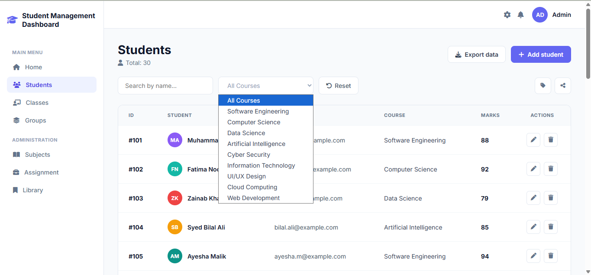
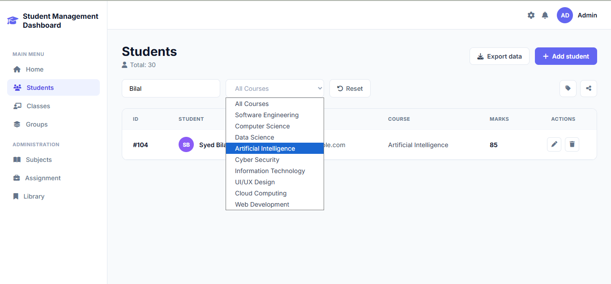
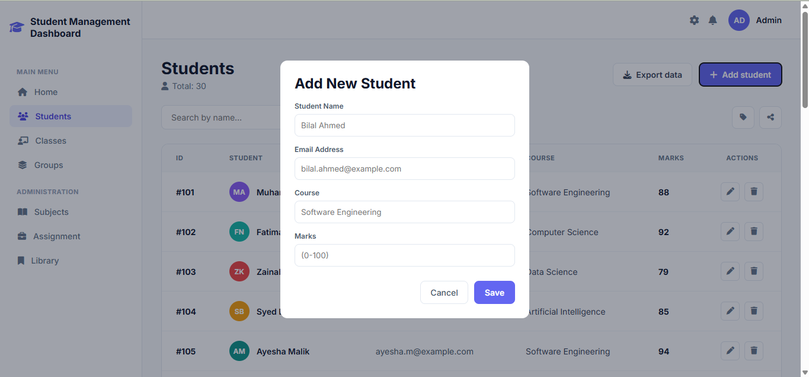

# Day - 03: Student Management Dashboard

A modern, responsive Student Management Dashboard built with **React** and **CSS3**. This application allows users to view, add, edit, filter, and delete student records dynamically.

## Features

- ** Display All Students:** Renders a dynamic list of student records in a structured table.
- ** Add New Student:** Modal form to register a new student with automated color avatar generation.
- ** Search Students by Name:** Real-time search functionality filtering records dynamically.
- ** Filter Students by Course:** Dropdown filter to view students enrolled in specific courses.
- ** Edit & Delete Student:** Complete CRUD operations with row-level action icons.
- ** Total Student Count:** Real-time badge counter displaying total registered students.

## Key React Concepts Used

- **Components:** Modular structure (`Sidebar`, `TopHeader`, `PageHeader`, `FilterToolbar`, `StudentTable`, `StudentModal`).
- **Props:** Passing data and handler functions across component hierarchies.
- **useState Hook:** Managing student arrays, form inputs, modal toggles, and filter states.
- **Forms & Event Handling:** Controlled inputs with `onChange` and `onSubmit` validation.
- **Array Methods:** `.map()` for rendering lists and `.filter()` for search/filter functionalities.
- **Conditional Rendering:** Modal display toggles and empty state handling.


## Tech Stack

- **Frontend Framework:** React.js
- **Styling:** Custom CSS3 (Flexbox, CSS Variables, Responsive Tables)
- **Icons:** Font Awesome Icons

## 📸 Application Screenshots

### Main Dashboard View


### Filter by Course & Search


### Add / Edit Student Modal


##  How to Run Locally

1. **Clone the repository:**
   ```bash
   git clone [https://github.com/your-username/your-repo-name.git](https://github.com/your-username/your-repo-name.git)

2. **Navigate to the project folder:**
   cd Day-03

3. **Install dependencies:**
   npm install

4. **Start the development server:**
   npm run dev


